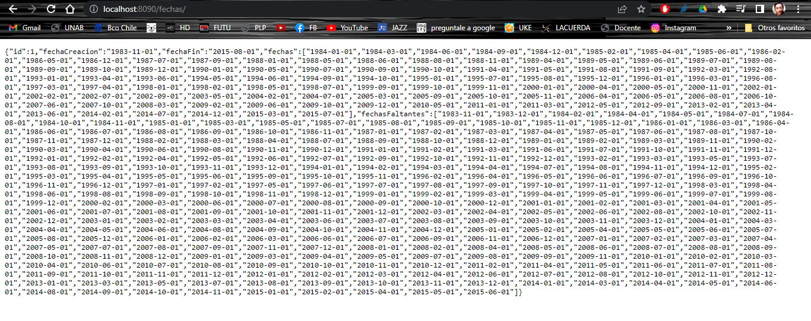

#  Desafio Tech Consult

Este proyecto Implementa un nuevo servicio REST. Este servicio REST invoca al servicio GDD y entregar la respuesta en formato JSON con las fechas recibidas y las fechas faltantes. Ejemplo de la respuesta que entrega el servicio:


*id*: identificador
*fechaCreacion*: Fecha de inicio de la secuencia
*fechaFin*: Fecha de fin de la secuencia
*fechas*: Lista de fechas que están en el rango de la fecha que se encuentra en “fechaCreacion” hasta la fecha “fechaFin”
Ejemplo.
```json
{
    "id": 6,
    "fechaCreacion": "1969-03-01",
    "fechaFin": "1970-01-01",
    "fechas": [
      "1969-03-01",
      "1969-05-01",
      "1969-09-01",
      "1970-01-01"],
    "fechasFaltantes": [
      "1969-04-01",
      "1969-06-01",
      "1969-07-01",
      "1969-08-01",
      "1969-10-01",
      "1969-11-01",
      "1969-12-01"]

}
```


Para copilar el proyecto se requiere Java y Maven instalado. Además de ejecutar la api periodos obtenidas desde el siguiente link https://github.com/lmptechconsult/Generador_Datos_Desafio_Uno  y luego levantarlo siguiendo las siguientes instrucciones
Ingresar al directorio *ApiPeriodos* ejecutar el siguiente comando *maven*

```bash
mvn package
```

Luego de compilar el proyecto ingresar al directorio *target* ejecutar el siguiente comando *java*

```bash
java -jar .\api-periodos-1.0.0.jar
```


Para compilar el proyecto desafiotc se debe ir al directorio *desafiotc* y ejecutar el comando *maven*

```bash
mvn package
```

Luego de compilar el proyecto ingresar al directorio *target* ejecutar el siguiente comando *java*

```bash
java -jar .\desafiotc-0.0.1-SNAPSHOT.jar
```

luego ir al navegador y entrar en la siguiente ruta: http://localhost:8090/fechas/

*Nota*:
Debe estar disponible el puerto *8080* y *8090* en el PC donde se ejecutan estas apis, para api-periodos y desafiotc respectivamente


Ejemplo salida en navegador
<p align="center">
  
</p>