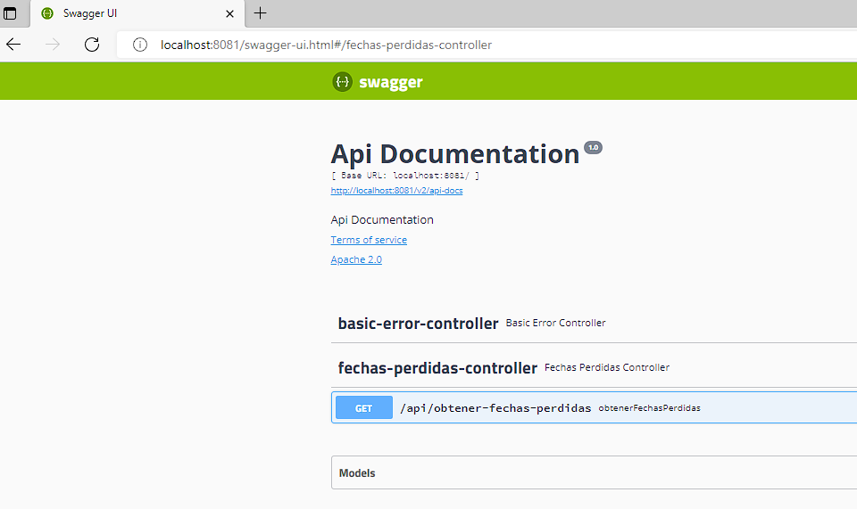

Nombre: Camilo Joaquin Navarrete Portiño

Mail: camilonavarreteportino@gmail.com

## <u>**Desafío 1 PreviRed Nivel 3.**</u>

#### **Recuperación de fechas perdidas a partir de consumo API GDD**

<h3 align="left">Lenguajes: Java SpringBoot</h3>

   

**Instrucciones:**

<u>Existen dos posibilidades:</u>

- Ejecutar directamente importando proyecto en un IDE de su preferencia
- Compilar proyecto en JAR y ejecutarlo desde una terminal.

Se debe tener habilitado el puerto 8081 (Designado para levantar via SpringBoot web)

Si se desea cambiar el puerto como la ruta de la API generadora de fechas, acceder a los archivos de configuracion aplication.properties y config.properties en la carpeta resources del proyecto para modificar.

Si desea ejecutarlo desde su IDE de preferencia, descargar el proyecto en conjunto con la API generador de fechas y alojarlos dentro de un directorio raiz.

Importar el proyecto como proyecto maven (Se utilizara IntellJ como ejemplo) y descargar las dependencias.

Este será reconocido como proyecto Maven (se debe tener previamente instalado Maven), detectando los servicios a ejecutar. Iniciar ambos servicios.

En caso de ejecutar el JAR:

Abrimos una terminal en la carpeta raíz del proyecto ejecutando el comando <u>**mvn clean package**</u> y esperamos una compilación exitosa.

Vamos a la carpeta target del proyecto, copiamos el nombre del jar generado y levantamos la aplicacion con el comando java **-jar target/fechasperdidas-0.0.1-SNAPSHOT.jar**

Con la aplicacion arriba podemos ejecutarla mediante 3 opciones: Navegador, Postman, Swagger UI

**Navegador:**

Introducimos la direccion local del equipo junto a su ruta API  ([localhost:8081/api/obtener-fechas-perdidas](http://localhost:8081/api/obtener-fechas-perdidas))

**Postman:** Colocamos la ruta (localhost:8081/api/obtener-fechas-perdidas) bajo peticion GET y consultamos con Send.

**Swagger:** Abrimos el navegador y colocamos la ruta (http://localhost:8081/swagger-ui.html), que nos abrira una interfaz grafica de Swagger para consultar el endpoint.

Seleccionamos fechas-perdidas-controller y presionamos GET.

Presionamos el boton TryOut y luego Execute dandonos la respuesta a la peticion con las fechas recuperadas.

